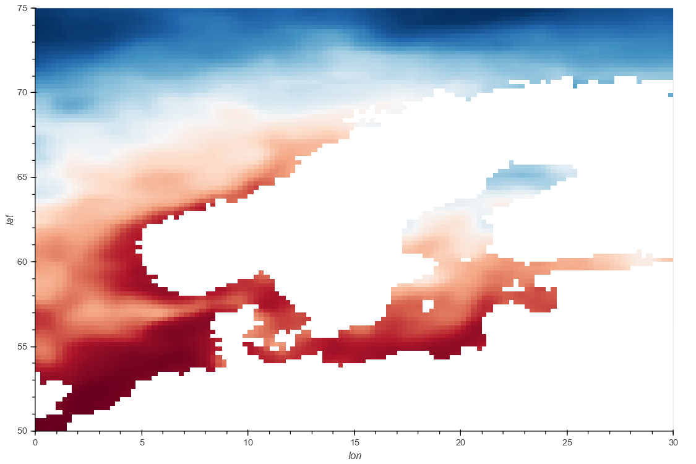

# SST Prozess
---
### Geosoftware II Projekt WiSe 2020/21 

## Inhaltsverzeichnis
[1. Übersicht](#overview) \
[2. Installation](#install) \
[3. Anwendung](#use) \
  3.1. Zentrale Funktionalität \
  3.2. API Endpunkte \
[4. Anhang](#annex)

<a name="overview"><h3>Übersicht</h3></a>
Dieses Projekt ist ein Teil für einen neuen [openEO](https://openeo.org/) Backenddriver der mit [Pangeo Software Stack](https://pangeo.io/) arbeitet.

Ziel ist einen Microservice zu erstellen, der mit den Pangeo Teilpaketen die Durchschnittsmeerestemperatur über einen nutzerbestimmten Zeitraum aus netCDF Datacubes errechnen kann.
Dabei wird konkret die Funktion /F0120/ des Pflichtenheftes umgesetzt.

Außerdem gibt es ein [Docker Repository](https://hub.docker.com/repository/docker/felixgi1516/geosoft2_sst_process), welches mit diesem verlinkt ist und über das nach Fertigstellung der Service als Image bezogen werden. Und dann als Container lokal genutzt werden kann.

<a name="install"><h3>Installation</h3></a>
:warning: _Die folgende Installation ist noch nicht verfügbar. Der Port und ähnliches können sich noch ändern._ 

Die Installation und Ausführung des Containers erfolgt über den Befehl:
```
docker run -p 3000:3000 felixgi1516/geosoft2_sst_process
````

<a name="use"><h3>Anwendung</h3></a>

#### Zentrale Funktionalität
Die Software greift einen Datacube im [netCDF](https://de.wikipedia.org/wiki/NetCDF) Format zu. Dieser beinhaltet tägliche Meerestemperaturdaten die räumlich und zeitlich strukturiert sind, wie diese [Daten](ftp://ftp.cdc.noaa.gov/Projects/Datasets/noaa.oisst.v2.highres/) der US-amerikanischen National Oceanic and Atmospheric Administration. Ist ein solcher Datensatz für die Software verfügbar (d. H. in einem Verzeichnis auf Sie zugreifen kann), sind Berechnung der Durchschnittstemperatur möglich. 

Dies geschieht über die zentrale Methode `mean_sst`, welche 2 Parameter entgegennimmt:

1. `timeframe` Eine Python-Liste mit Anfangsdatum und Enddatum im [ISO 8601](https://www.iso.org/iso-8601-date-and-time-format.html) Format **yyyy-mm-dd** (z. B. ['2007-06-01','2007-08-31' für den Sommer 2007]). Über diesem Zeitraum wird das Mittel errechnet.
2.  Eine Boundingbox mit vier Eckkoordinaten, für eine geographische Auswahl des Berechnungsraums (z. B. [0, 50, 30, 75] für den Raum Nordeuropa)

Die Ausgabe erfolgt über ein Dask Dataset. Visualisiert können Ergebnisse so aussehen:


Weltweites Mittel des 01.01.1981


Mittel des Monats Oktober 1981 für den Raum Nordeuropa

#### API Endpunkte
Der Microservice soll über Endpoints aufrufbar sein, leider sind noch keine verfügbar.

:bangbang: Endpoints anlegen und hier dokumentieren


<a name="annex"><h3>Anhang</h3></a>

#### Verwendete Software

Software | Version
------ | ------
[Python](https://www.python.org/)   | 3.8.6
[xarray](http://xarray.pydata.org/en/stable/)   | 0.16.1
[dask](https://dask.org/)   | 2.30.0

